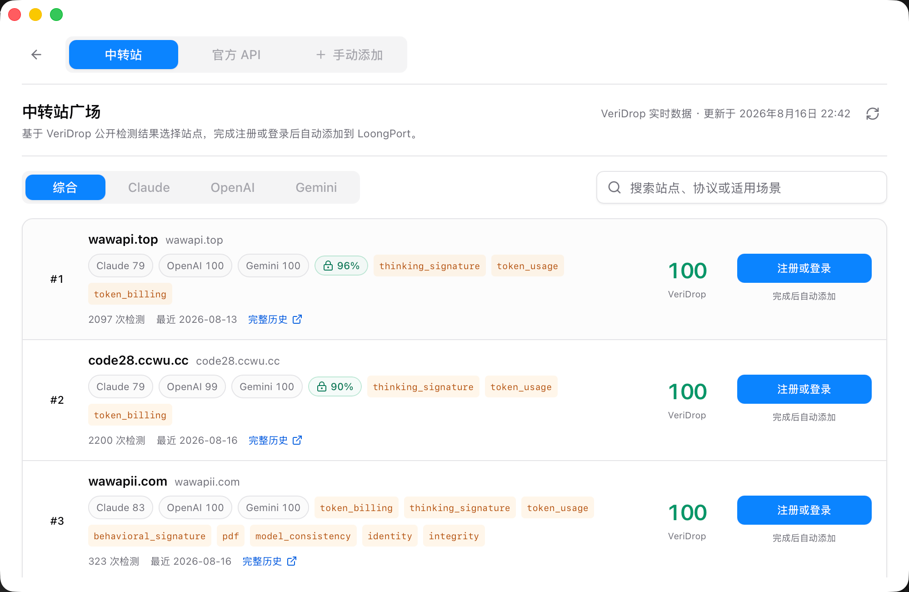
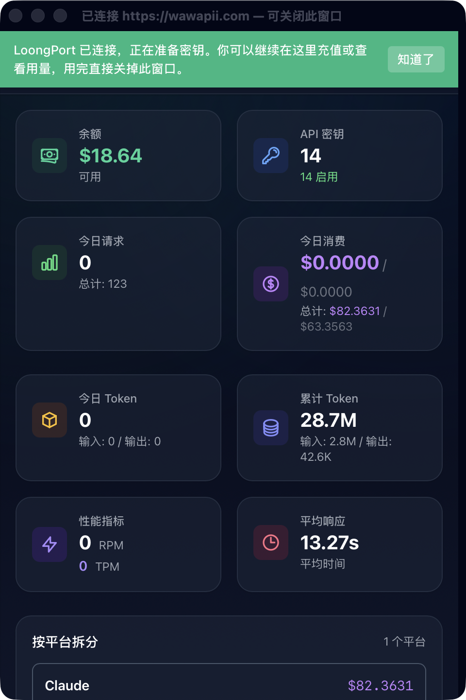
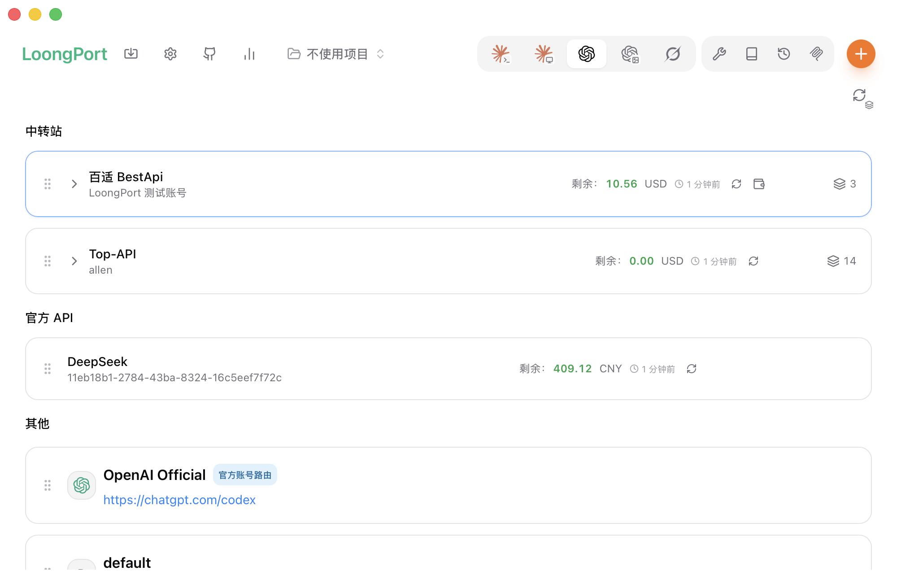
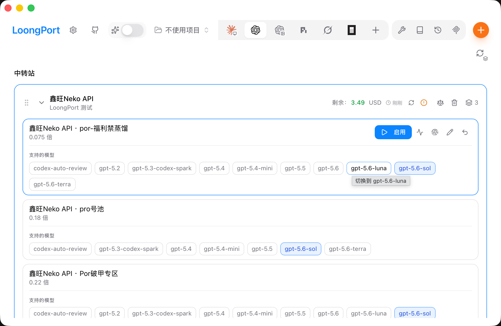
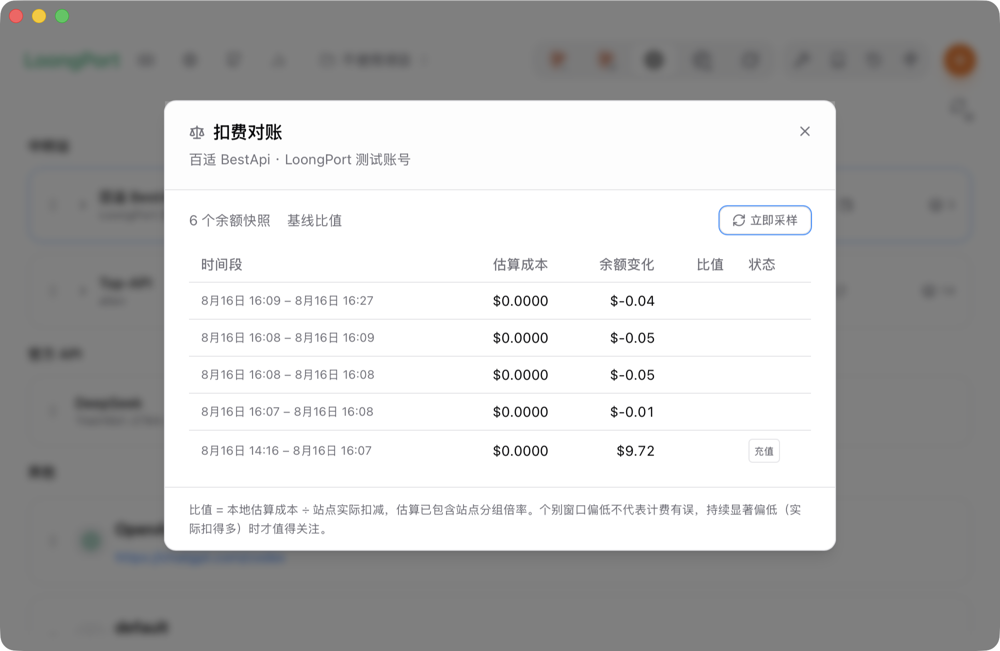
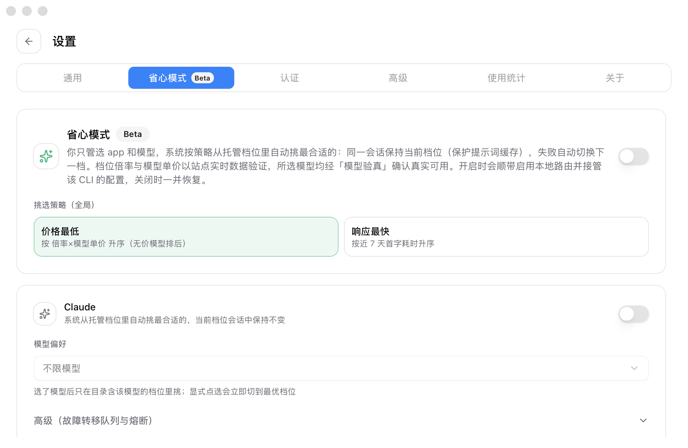
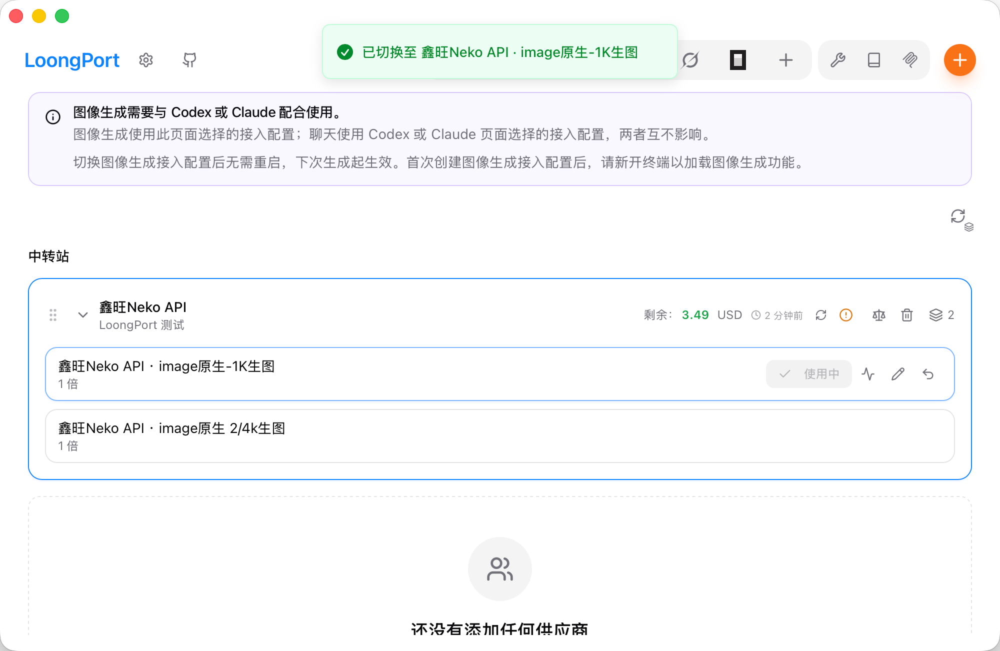
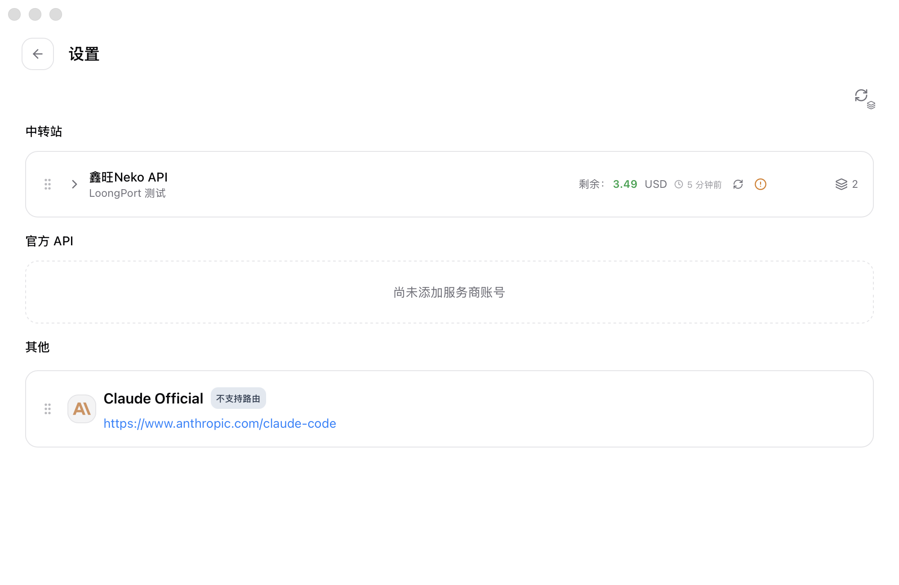
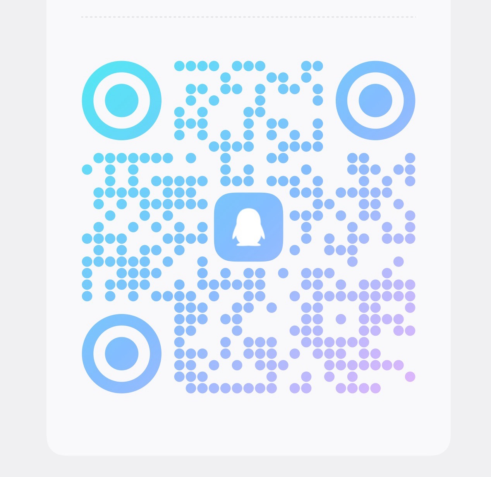

<div align="center">

# cc-switch 中转站省钱教程

### 用 LoongPort（基于 cc-switch 的中转站增强版）给 Claude Code / Codex 接中转站 API——填一个域名，登录一次，剩下全自动

[](https://github.com/SailingLoong/LoongPort/releases/latest)
[](https://loongport.dev)

[](https://github.com/SailingLoong/LoongPort/releases)
[](LICENSE)

**Codex 只花官方价的 5%，Claude 只花 20%，国内直连。**

</div>

---

## 这篇教程解决什么问题

你想用 Claude Code 或 Codex CLI，但官方 API 按官网价计费，付款还要外卡。中转站能把成本打到官方价的一两成，可接入流程很劝退：注册后要进控制台手建 API Key、抄对 `base_url`、翻出各 CLI 的配置文件把字段写对——Codex 一套、Claude 一套，换个档位再来一遍。

如果你用过 [cc-switch](https://github.com/farion1231/cc-switch)（GitHub 12 万+ Star 的 AI CLI 供应商切换器），「切换」这步已经被解决了；但中转站特有的麻烦——**余额在哪看、有没有被多扣钱、档位挂了谁来切**——还是得自己操心。

这篇教程用 **[LoongPort](https://github.com/SailingLoong/LoongPort)** 走完这条链路。LoongPort 基于 cc-switch（从 v3.19.1 fork、持续合并上游），专为中转站场景增强，把上面那串事情压成：

> **填一个域名，登录一次。** 它会为你账号能用的每个档位备好 Key、按各 CLI 的形状把配置写好，之后换档位就是点一下。

> **不用先装 cc-switch。** LoongPort 是独立应用，直接下载就能用——本教程从头到尾只需要这一个软件。
>
> 已在用 cc-switch？两边数据目录分开（`~/.cc-switch/` 与 `~/.loongport/`），可以同时装、同时开；LoongPort 能一键把 cc-switch 的现有配置搬过来（见[下文](#从-cc-switch-一键导入)），搬完用 LoongPort 就行。

## 能省多少钱

两层优惠，Codex 吃到两层，Claude 只吃到一层：

| 因素 | | 谁吃得到 | 为什么 |
|---|---|---|---|
| 档位倍率 | **×0.1** | 只有 Codex | 多数 GPT 档位的计费倍率是 0.1——同样的 token 用量，按官方价的一折计费；Anthropic 档位没有这个折扣 |
| 汇率口径 | **×1/6.7** | Codex 与 Claude 都有 | 中转站普遍按「1 人民币抵 1 美元」计价，而实际汇率约 1 美元兑 6.7 人民币 |

即 Codex 约为官方 API 成本的 **1.5%**、Claude 约 **15%**（随档位和站点浮动，上文「5% / 20%」留了余量）。完整推导见
[loongport.dev/zh/pricing](https://loongport.dev/zh/pricing)。

## LoongPort 在 cc-switch 基座上，为中转站加了什么

| 能力 | 说明 |
|---|---|
| 🔑 **填域名，登录一次** | 打开中转站**自己的**注册/登录页，登录后自动为你账号能用的每个档位备好 API Key、写好各 CLI 的配置——不用进控制台手建 Key，不用抄 `base_url` |
| 🏪 **中转站广场** | 基于 VeriDrop 公开检测评分的站点榜单（综合 / Claude / OpenAI / Gemini 分榜）——挑站不再靠群友口口相传；搜索不到的域名就地转添加 |
| 🔗 **官方 API 直连** | DeepSeek 开放平台、智谱 BigModel、opencode Zen：登录后自动创建/认领 API Key——不走中转站也能一键接入 |
| 💰 **主界面看余额** | 每个站点账号一行：余额、档位数、倍率徽标一目了然；点一下就能开这个站**自己的**充值页 |
| 📊 **扣费对账** | 本地估算成本 ÷ 站点实际扣减，按时间段列表；实际扣减持续达到估算 2 倍以上会标「偏低」，充值/返利自动识别不计入 |
| 🧘 **省心模式（Beta）** | 开一次，系统按策略自动挑托管档位：价格最低（倍率×模型单价，站点实时验证）或响应最快；同一会话不切换，档位故障/闲置才换；模型均经「模型验真」确认；关闭即恢复原配置 |
| 🎨 **CLI 对话里生图** | 生图档位与对话档位各自独立——聊天走 A 档、出图走 B 档；换生图档位不用重启 CLI |
| 🖥 **托盘快切** | 系统托盘菜单直接切换当前档位，不用开主窗口 |
| 📦 **从 cc-switch 导入** | 一键迁移 cc-switch 里已有的供应商配置与 API 密钥 |
| 🎁 **点 Star 领 $5** | 新用户给仓库点个 Star，应用内跟着引导操作，可领 $5 注册礼 |
| 🧩 **基座能力都在** | cc-switch 的多供应商管理、Skills、提示词、会话管理、MCP 管理面板全部保留 |

> LoongPort 免费、开源（MIT）、无账号体系、无服务端——不经手你的付款，也不从你的余额抽成。

## 保姆级四步

### 第 1 步：下载安装

到 **[loongport.dev/zh/download](https://loongport.dev/zh/download)**（或
[GitHub Releases](https://github.com/SailingLoong/LoongPort/releases/latest)）下载。

- **Windows**：推荐 `Setup.exe` 安装版（建开始菜单项、支持应用内自动升级）；也有解压即用的免安装版
- **macOS**：`dmg` 两种芯片通用

> **只需要下载 LoongPort 这一个应用，不需要先装 cc-switch**——它是 LoongPort 的开源基座，不是前置依赖。

> **macOS 首次打开会被拦一下。** 未做 Apple 签名与公证，Gatekeeper 会报「已损坏」——不是真的损坏。先拖进「应用程序」、**别打开**，然后在终端执行一次：
>
> ```bash
> xattr -dr com.apple.quarantine /Applications/LoongPort.app
> ```
>
> 之后正常打开，只做这一次。原理说明见[下载页](https://loongport.dev/zh/download)。

### 第 2 步：挑一个中转站

第一次打开会落在「**中转站广场**」——基于 VeriDrop 公开检测结果给站点排的榜单（综合 / Claude / OpenAI / Gemini 四个分榜）。每个站点一行：三个协议各自的成功分数、检测次数与最近检测时间、VeriDrop 综合分，点「注册或登录」完成后自动添加到 LoongPort。也可以用顶部搜索框搜站点、协议或适用场景；已经在别处注册过站点的，把域名粘进搜索框，搜不到就地转添加。

<div align="center">
  
</div>

同一页还有两个标签：

- **官方 API**——DeepSeek 开放平台、智谱 BigModel、opencode Zen：登录后自动创建/认领 API Key，接入各编程代理（不走中转站）
- **手动添加**——手填任意域名，从浏览器地址栏整条复制也行（`https://example.com/console` 后面的路径会自动去掉）

### 第 3 步：在站点自己的页面注册 / 登录

LoongPort 会打开**这个站自己的**注册页：

- 新账号：直接在页面里注册
- 已有账号：页面顶部有一条横幅，一键转去登录

整个注册/登录都在站点的真实页面里完成，**LoongPort 不经手你的密码**。登录成功后，窗口里会出现绿色横幅：

<div align="center">
  
</div>

你可以留在这个窗口里顺便充值、看用量，用完直接关掉——LoongPort 已经拿到登录后的凭据，正在为你准备密钥。

### 第 4 步：完事

你账号下能用的每个档位都已备好 Key、写好配置。主界面长这样：

<div align="center">
  
</div>

之后：

- **换档位**：点一下「启用」。Key 会先复用你账号里名字匹配的，找不到才新建——反复刷新不会堆垃圾 Key
- **充值**：点余额旁的按钮，开这个站自己的充值页
- **切 Codex 档位时**会自动退出并重开 ChatGPT 桌面版（它只在启动时读配置）。macOS 上是「请求退出」，有进行中的对话它会自己弹确认框、可以取消；Windows 上是先告知你一次再强制结束

在 Codex 页里，登录后自动备好的各档位长这样——按模型收拢成卡片，带 0.1× 计费倍率徽标与价格，点「启用」即切换：

<div align="center">
  
</div>

## 进阶：把中转站用到底

### 扣费对账：站点有没有多扣你钱

每个站点账号行的「**查看扣费对账**」打开对账表：按时间段列出**本地估算成本** vs **余额实际变化**，算出比值。

<div align="center">
  
</div>

- 比值 = 本地估算成本 ÷ 站点实际扣减（估算已包含站点分组倍率）
- 实际扣减**持续**达到估算 2 倍以上 → 标「偏低」，值得去站点核对账单
- 余额增加（充值、返利、赠送）自动标「充值」，不计入比值

### 省心模式（Beta）：档位挂了谁来切

设置里的「省心模式」开一次，系统按策略自动挑选托管档位，你不用再管「现在用哪档、挂了切谁」：

- **价格最低**——按档位倍率 × 模型单价排序，价格经站点实时验证，「不知道多少钱」的档位宁可排后也不冒充便宜
- **响应最快**——按近 7 天首字耗时排序，追求手感

同一会话内保持当前档位不切换（避免丢失提示词缓存）；档位故障或闲置后，才自动换到更合适的一档。所选档位的模型都经「模型验真」确认真实可用。开启时会一并开启本地路由接管该 CLI 的流量（关闭省心模式即一并恢复），顶栏的常驻开关随时可关。

<div align="center">
  
</div>

### 在 CLI 对话里生图

站点有生图档位时，「**Codex 生图**」标签页会出现这些档位。点「启用」后，在 Codex、Claude Code 或 Gemini CLI 的对话里直接说「生成一张图」即可——生图靠 LoongPort 内置的一个工具（MCP server）完成。

- **对话档位不必让出来**：聊天走对话档位、生图走生图档位，两个「当前项」各自独立——可以一边用 DeepSeek 聊天、一边用中转站的 4K 档位出图
- **换生图档位不用重启 CLI**；只有第一次启用生图时需要新开一个终端

<div align="center">
  
</div>

### 运营中转站？广场就是你的曝光位

「中转站广场」的榜单对所有 LoongPort 用户可见，站点评分基于 [VeriDrop](https://veridrop.org) 公开检测结果。想让你的站点被收录、被用户按分挑到：到 [LoongPort 仓库开个 issue](https://github.com/SailingLoong/LoongPort/issues) 说一声即可。

你还可以把 LoongPort 当作**你自己站点的客户端**推给用户：它没有账号体系、没有服务端——用户注册的是**你的站**，充值走**你的**收款页，凭据只存在用户自己电脑上；有 aff / 优惠码机制的话注册时自动带上。接入指南：
[loongport.dev/zh/for-relays](https://loongport.dev/zh/for-relays)

### 从 cc-switch 一键导入

没在用 cc-switch？这一节可以跳过——LoongPort 不依赖它。已在用 cc-switch？**设置 → 数据 → 「从 cc-switch 导入」**会把它的配置一次性复制过来，不动 cc-switch 那边——勾选要迁的内容后一键导入。

<div align="center">
  
</div>

## 安全与隐私

- 凭据只存在**本机** `~/.loongport/` 的 SQLite 里，作为 Bearer token 只发给你选的那个中转站
- LoongPort **无账号体系、无服务端**——它拿不到你的凭据，也不经手你的付款
- 官方账号不受影响：Codex 的 `~/.codex/auth.json` 默认保留不写；Claude 的凭据（`.credentials.json`）与配置（`settings.json`）本来就是两个文件

## FAQ

**需要先装 cc-switch 吗？**
不需要。LoongPort 是独立应用，下载即用；cc-switch 只是它的上游基座。这篇教程反复提到 cc-switch，一是因为 LoongPort 基于它构建，二是想帮已经在用 cc-switch 的同学一键迁移过来。

**和 cc-switch 什么关系？**
LoongPort 从 [cc-switch](https://github.com/farion1231/cc-switch) v3.19.1 fork、持续合并上游，图标衍生自它，MIT 协议与版权声明保留在 [LoongPort 仓库](https://github.com/SailingLoong/LoongPort)里。cc-switch 是通用的多供应商管理器；LoongPort 专注「用中转服务省钱跑 AI CLI」这一条链路。感谢 [@farion1231](https://github.com/farion1231) 打的基座。

**两个能同时装吗？**
能。数据目录分开（`~/.cc-switch/` 与 `~/.loongport/`），互不干扰。

**支持哪些中转站？**
跑 [sub2api](https://github.com/Wei-Shaw/sub2api) 的站全支持；new-api 适配进行中。域名自由填，不绑定任何一家站。

**LoongPort 收费吗？**
免费、开源（MIT）。你充值给的是中转服务商，LoongPort 不抽成。注册链接会带作者邀请码、可能产生返利，不影响你的价格。

**有 Linux 版吗？**
macOS 与 Windows 功能一致；Linux 在做。

**遇到问题去哪问？**
[LoongPort 仓库 Issues](https://github.com/SailingLoong/LoongPort/issues)，或加 QQ 群 **773696474**。

## 相关链接

| | |
|---|---|
| **LoongPort 主仓库** | [github.com/SailingLoong/LoongPort](https://github.com/SailingLoong/LoongPort)——觉得有用点个 ⭐，新用户跟着应用内引导点 Star 还能领 $5 注册礼（活动细节以应用内提示为准） |
| **官网** | [loongport.dev](https://loongport.dev)——下载、定价推导、给中转站负责人的接入指南 |
| **cc-switch 上游** | [github.com/farion1231/cc-switch](https://github.com/farion1231/cc-switch) |

<div align="center">

**如果这篇教程帮到了你，去 [LoongPort 仓库](https://github.com/SailingLoong/LoongPort) 点个 ⭐ 吧**



</div>

## License

[MIT](LICENSE)
